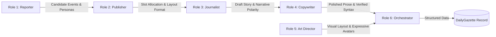

# TOURNAMENT EDITORIAL ENGINE - MASTER ARCHITECTURE & IMPLEMENTATION GUIDE (v2.0)

## 1. Executive Summary & Vision
We are building the **Tournament Editorial Engine** within an existing Django football prediction application. 

This engine powers the **"Insight and Analysis" tab** on the frontend, structured into two core sections:
1. **Section 1: Prediction Insights (The Almanac / Gängets Tipsanalys):** A 9-box structured pre-tournament analytical matrix detailing group consensus, decisive vs. draw splits, goal extremes, wild takes, lone-wolf picks, and delusion rankings.
2. **Section 2: The Tournament Gazette (Card Grid & Newspaper Modal):** A dynamic feed supporting both granular **Daily Matchday Editions** and strategic **Round & Stage Milestone Editions** (Lock Previews, Round Conclusions, Mid-Tournament Audits, and the Grand Finale).
   * **Card Preview Grid:** Displays edition cadence badges, date/stage references, AI-generated hero visuals, bold Swedish headlines, and taglines.
     * **Daily Gazetta (Golden Frame):** Styled with a glowing gold border (`border: 2px solid #facc15; box-shadow: 0 0 25px rgba(250, 204, 21, 0.28);`) and masthead badge `🗞️ DAGLIGA GAZETTEN`.
     * **Round Gazetta (Purple Frame):** Styled with a glowing royal purple border (`border: 2px solid #8b5cf6; box-shadow: 0 0 28px rgba(139, 92, 246, 0.42);`) and masthead badge `🏆 OMGÅNGSMAGASIN • <Round Name>`.
   * **Full Editorial Modal:** Expands into a multi-story newspaper column complete with deep analytical breakdowns, oracle forecasts, and itemized player dossiers.

---

## 2. Strict Language, Cultural & Privacy Directives

### 2.1 Language & Cultural Directive
To ensure backend maintainability while delivering peak comedic value, code and content are strictly divided by language:
* **100% English:** All Django code, model names, fields, comments, docstrings, backend logic, function names, JSON payload keys, and LLM prompt instructions.
* **100% Swedish:** All LLM-generated output (Headlines, Taglines, Body Markdown, Player Dossiers, Pub Quotes, Roasts, Image Concepts).
* **Cultural Tone:** Dry, sarcastic Scandinavian sports journalism combined with cynical Swedish pub banter. Understated, witty, sharp—strictly zero corporate enthusiasm, artificial excitement, or motivational cheerleading.

### 2.2 Pool Tenancy & Banter Isolation Directive
* **Private Group Isolation (`is_private_friend_group=True`):** Exclusive to **Toarps Herrklubb**. Injects custom member nicknames (*Fempa, Dahl, Lage, Szabo, etc.*), private avatars/caricatures, historical group banter, and internal group rivalries into the narrative.
* **Standard / Commercial Pools (`is_private_friend_group=False`):** Enforces clean real first names or display names (e.g., *Johan, Terece, Lucas, Anton*). Image prompts use neutral, stylized stadium or editorial artwork. Content maintains an engaging sports-columnist tone with **zero** private nicknames, inside jokes, or personal memes.

### 2.3 Deterministic Authority & Anti-Hallucination
* **Deterministic Ownership:** The Python/Django backend strictly owns all calculations, point tabulations, Expected Value (EV) metrics, Monte Carlo simulations, and ranking orders.
* **Zero Causal Hallucination:** The LLM is forbidden from inventing unprovided match facts (e.g., fake red cards, injuries, or non-existent incidents). It only contextualizes the verified data points passed to it.

---

## 3. Core Architecture (The 4-Tier System)
Tier separation must be strictly maintained. Never let the LLM handle data analysis, mathematical modeling, or standings ranking.

* **Tier 1: Deterministic Data Engine (Python / Django ORM):**
  Analyzes raw prediction data, match results, slip Expected Value (EV), and Monte Carlo championship simulations. Generates `StaticInsight` records (Section 1) and `InsightEvent` records (Section 2).
* **Tier 2: Context Compiler & Anti-Repetition Editor (Python Logic):**
  Assembles payload bundles, manages decaying `StorylineMemory`, tracks simulation deltas, enforces pool privacy rules, and injects structural format rotations, negative phrases, and visual style modifiers.
* **Tier 3: Storyteller & Visualizer (LLM & Media Integration):**
  Consumes Tier 2 JSON payloads to generate Swedish prose, headlines, taglines, dossiers, and image prompts matching strict JSON output schemas. Resolves image prompts via Image API or local themed visual assets.
* **Tier 4: Presentation & Delivery (Django Views & Templates):**
  Renders the responsive card grid on the "Insight and Analysis" tab and powers the reader modal for full multi-story editions.

---

## 4. Edition Cadence, Lifecycle & Content Matrix

| Scope | Edition Type | Trigger | Content Structure & Mandatory Stories |
| :--- | :--- | :--- | :--- |
| **Round** | `PREDICTIONS_LOCK` | Round deadline closes (before Match 1 kickoff) | **1. Omgångens Karaktär:** Macro slate narrative & group consensus.<br>**2. Orakeltipset (3 Perspectives):** Scientist *(Sannolikhet)*, Expert *(Taktik)*, WildCard *(Kaos)*.<br>**3. Superdatorns Dom:** Monte Carlo Championship Win % update.<br>**4. Minneskontrollen:** Historical archive check of past statements.<br>**5. Omgångens Kupongbikt:** **2–3 sentence analysis per player slip.** |
| **Daily** | `DAILY_MATCHDAY_RECAP` | Final whistle of the day's last match | **Format Rotation (1 of 4):** Standard Column, Winners/Losers, Post-Match Interview, or Pub Banter covering 2–3 distinct daily match events. |
| **Round** | `ROUND_CONCLUSION` | Final match of a multi-day round finishes | **1. Tabellkriget & Rivaliteter:** Leaderboard delta, biggest climber/faller, tight margins ($P_1 - P_2 \le 2$).<br>**2. Kung & Haverist:** Round MVP vs. worst collapse.<br>**3. Guldchansens Omräkning:** Live tournament simulation shift.<br>**4. Skampålens Återbesök:** Auditing past claims against round results.<br>**5. Kupongdödaren:** The decisive match that wrecked consensus. |
| **Stage** | `GROUP_STAGE_POST_MORTEM` | Final group match finishes | **1. Gruppspelets Bokslut:** Tournament audit & surviving bracket health.<br>**2. Mästartipsens Obduktion:** Roasting dead champion picks.<br>**3. Slutspelets Favoriter:** Simulation odds entering the knockout tree. |
| **Stage** | `KNOCKOUT_STAGE_POST_MORTEM`| Quarter/Semi-finals conclude | **1. Slutspelets Schavott:** Post-mortem on ruined brackets & sudden-death carnage.<br>**2. Finalens Hävstång:** Mathematical tipping points for trailing chasers. |
| **Finale** | `TOURNAMENT_FINALE` | Final whistle of the Grand Final | **1. Podiets Slutstrid:** Rise and fall of the Top 3 & decisive final moment.<br>**2. Jumboplatsens Anatomi:** Dissection of last place (*Träsleven*).<br>**3. Skuggpriserna:** *Turknutten* (fluke master), *Teoretiske Mästaren* (high EV/low pts), *Kaoskungen*.<br>**4. Almanackans Slutdom:** Grand audit of pre-tournament claims.<br>**5. Det Sista Slutbetyget:** **2–3 sentence epitaph per player** (ranked 1 to N). |

---

## 5. Section 1: The 9 Standardized Prediction Insights (Almanackan)

| # | Insight Card | Engine Implementation & Mathematical Model |
| :--- | :--- | :--- |
| **1** | **Avgjorda Matcher (Spikvilja)** | Aggregates % 1 & 2 predictions. Highlights the pool's *Avgörande-förespråkare* vs. *Kryssgarderare*. |
| **2** | **Oavgjorda Matcher (Kryssbenägenhet)** | Aggregates % X predictions. Highlights *Kryss-kungen* vs. *Kryss-skeptikern*. |
| **3** | **Gängets Banker (Superkonsensus)** | Finds the match with highest agreement on a single sign (`1`, `X`, or `2`). Uses **goal variance** as tie-breaker (lowest variance wins). |
| **4** | **Skiljematchen (Vattendelaren)** | Uses **Shannon Entropy** to identify the match with the highest sign disagreement (e.g. 3-way split or 50/50 division). |
| **5** | **Målprognos & Extremer** | Calculates total goals and goal averages. Highlights the *Grand Optimist* vs. *Defensiv Pragmatiker* and their goal difference. |
| **6** | **Omgångens Målfest (Målgladaste Matchen)** | Identifies the single match with the highest expected aggregate goal average + highlights *Vassaste måltipset*. |
| **7** | **Ensamvargar (Djärva Solospel)** | Detects solitary outsider picks (1 player vs. pool consensus) and lists the top 3 examples with match and scoreline. |
| **8** | **Mästarkonsensus** | Analyzes gold/champion sidebet answers with graceful empty-state fallback (*"Ingen vinnarfråga registrerad"*). |
| **9** | **Skytteliga & Sidebets** | Analyzes top-scorer / secondary tournament sidebets with graceful empty-state fallback (*"Inget aktivt sidebet"*). |

---

## 6. Database Schema (Django Models)

```python
# tournament/models.py
from django.db import models
from django.contrib.auth.models import User

class League(models.Model):
    name = models.CharField(max_length=200, help_text="Private friend group or commercial pool name")
    is_private_friend_group = models.BooleanField(
        default=False,
        help_text="Enables insider nicknames, private banter, and customized caricatures (Toarps Herrklubb only)."
    )

    def __str__(self):
        return self.name

class StaticInsight(models.Model):
    CATEGORY_CHOICES = (
        ('SIGN_DECISIVE', 'Avgjorda Matcher (Spikvilja)'),
        ('SIGN_BALANCE', 'Oavgjorda Matcher (Kryssbenägenhet)'),
        ('BANKER_CONSENSUS', 'Gängets Banker (Superkonsensus)'),
        ('DELUSION_INDEX', 'Skiljematchen (Vattendelaren)'),
        ('GOAL_DELUSION', 'Målprognos & Extremer'),
        ('CERTIFIED_MADNESS', 'Omgångens Målfest'),
        ('LONE_WOLF', 'Ensamvargar (Djärva Solospel)'),
        ('CHAMPION_CONSENSUS', 'Mästarkonsensus'),
        ('GOLDEN_BOOT', 'Skytteliga & Sidebets'),
        ('CONSENSUS_ALERT', 'Konsensusvarning'),
        ('SIGN_HOME', 'Hemmasegrar'),
        ('SIGN_AWAY', 'Bortasegrar'),
        ('GENERAL', 'Allmän Insikt'),
    )
    tournament = models.ForeignKey('Tournament', on_delete=models.CASCADE, related_name='static_insights')
    category = models.CharField(max_length=50, choices=CATEGORY_CHOICES)
    player_name = models.CharField(max_length=255, blank=True, null=True)
    data_point = models.TextField()  # e.g., "86% || Avgjorda matcher (1 & 2)"
    llm_roast = models.TextField()   # 100% Swedish commentary and benchmark
    is_published = models.BooleanField(default=True)

class InsightEvent(models.Model):
    tournament = models.ForeignKey('Tournament', on_delete=models.CASCADE, related_name='events')
    player_name = models.CharField(max_length=150)
    type = models.CharField(max_length=50)  # 'ELIMINATION', 'BIG_MOVER', 'BANKER_BUST'
    description = models.TextField()       # e.g., "Lucas föll från 1:a till 5:e plats."
    importance_score = models.IntegerField(default=50)  # 0-100
    matchday_date = models.DateField(null=True, blank=True)
    created_at = models.DateTimeField(auto_now_add=True)
    is_used = models.BooleanField(default=False)

class StorylineMemory(models.Model):
    class MemoryType(models.TextChoices):
        ORACLE_BACKING = 'ORACLE_BACKING', 'Oracle Endorsement'
        BOLD_PREDICTION = 'BOLD_PREDICTION', 'Lone Wolf / Bold Pick'
        PROJECTION_COLLAPSE = 'PROJECTION_COLLAPSE', 'Championship Favorite Crash'
        RIVALRY_SPARK = 'RIVALRY_SPARK', 'Table Rivalry'

    tournament = models.ForeignKey('Tournament', on_delete=models.CASCADE, related_name='memories')
    player_name = models.CharField(max_length=150)
    memory_type = models.CharField(max_length=30, choices=MemoryType.choices, db_index=True)
    origin_round = models.PositiveIntegerField()
    quote_or_claim = models.TextField(help_text="Original claim or oracle statement")
    context_data = models.JSONField(default=dict, help_text="Metrics: EV, odds, predicted scores")
    is_resolved = models.BooleanField(default=False)
    aged_verdict = models.CharField(max_length=50, blank=True, null=True)  # AGED_LIKE_MILK, PROPHETIC, PENDING
    created_at = models.DateTimeField(auto_now_add=True)

class TournamentSimulationSnapshot(models.Model):
    tournament = models.ForeignKey('Tournament', on_delete=models.CASCADE, related_name='simulations')
    round_number = models.PositiveIntegerField(db_index=True)
    projected_winner = models.ForeignKey(User, on_delete=models.CASCADE)
    win_probability_pct = models.DecimalField(max_digits=5, decimal_places=2)  # e.g. 36.40
    probability_delta = models.DecimalField(max_digits=5, decimal_places=2, default=0.0)  # e.g. +4.10
    chasing_pack = models.JSONField(default=list)  # Top contenders with win % and point gaps
    created_at = models.DateTimeField(auto_now_add=True)

class DailyGazette(models.Model):
    class Cadence(models.TextChoices):
        DAILY = 'DAILY', 'Daily Matchday Edition'
        ROUND_MILESTONE = 'ROUND_MILESTONE', 'Round / Stage Milestone'

    tournament = models.ForeignKey('Tournament', on_delete=models.CASCADE, related_name='gazettes')
    is_special_edition = models.BooleanField(default=False, db_index=True)  # False: Daily (Gold), True: Round (Purple)
    round_number = models.PositiveIntegerField(null=True, blank=True)
    round_name = models.CharField(max_length=100, blank=True)
    publish_date = models.DateField(db_index=True)
    
    headline = models.CharField(max_length=255)
    tagline = models.CharField(max_length=255)
    image_url = models.URLField(max_length=500, blank=True)
    image_prompt = models.TextField(blank=True)
    content_format = models.CharField(max_length=50)  # 'STANDARD_COLUMN', 'WINNERS_LOSERS', 'INTERVIEW', 'PUB_QUOTES'
    content = models.TextField()  # Full Markdown body in 100% Swedish
    tone_used = models.CharField(max_length=100, default='Torr Skandinavisk Humor')
    structured_data = models.JSONField(default=dict)

    # 4-Section Milestone Storylines
    headline_top_contenders = models.TextField(blank=True)
    headline_standout_results = models.TextField(blank=True)
    headline_worst_performers = models.TextField(blank=True)
    analysis_outlook = models.TextField(blank=True)

    class Meta:
        ordering = ['-publish_date', '-id']

class StyleExample(models.Model):
    quote = models.TextField(help_text="Swedish roast/commentary sample to calibrate tone")
    is_active = models.BooleanField(default=True)

class EditorialSettings(models.Model):
    banned_phrases = models.JSONField(default=list, help_text="List of overused cliches to forbid")
```

---

## 7. Tier 2 Context Compilation & Anti-Repetition Logic

To prevent LLM fatigue across multi-week tournaments, Tier 2 dynamically injects variety controls and structured data contracts:

* **Format Rotation (Daily Editions):** Python randomly rotates between 4 daily templates (`STANDARD_COLUMN`, `WINNERS_LOSERS`, `INTERVIEW`, `PUB_QUOTES`), weaving at least 2–3 distinct `InsightEvent` records into the copy.
* **Oracle Archetype Packaging (Round Lock Editions):**
  * 🔬 **Vetenskapsmannen (The Scientist):** Evaluates mathematical Expected Value (EV), leverage points, and game-theory consensus deviations.
  * ☕ **Experten (The Expert):** Evaluates real-world tactical dynamics, low-block defensive setups, and squad form.
  * 🌪️ **Kaospiloten (The WildCard):** Calculates maximum entropy and black-swan events (underdogs, upsets, 0-0 draws).
* **Monte Carlo Simulation Tracking:** Every round edition calculates and presents live tournament championship probabilities, tracking round-over-round probability deltas ($\Delta\%$).
* **Storyline Memory & Archive Reckoning:** Dynamically queries past unresolved claims or oracle backing from `StorylineMemory` to roast predictions that aged like milk or praise prophetic calls.
* **Visual Style Modifier Rotation:** Randomizes image prompt modifiers (*1920-tals politisk satirteckning, rå 1970-tals vintage polaroid, dramatiskt 1990-tals sporttidningsomslag, minimalistisk skandinavisk affisch*).
* **Negative Prompt Injection:** Injects `EditorialSettings.banned_phrases` into the prompt to ban generic AI fillers (*"det återstår att se", "en sak är säker", "i en oväntad vändning"*).

---

## 7.5 Multi-Role Editorial Pipeline (Agent Roles 1–6)

To prevent factual contradictions, repetition, and stylistic drift, the engine operates as a sequential 6-role editorial pipeline where each agent has strict responsibilities:



### Role Breakdown & Responsibilities

| Role | Module | Primary Responsibilities & Contracts |
|---|---|---|
| **1. Reporter** | `reporter.py`, `detectors.py`, `special_edition_reporter.py` | **Event & Data Discovery**: Scans database for completed matchdays, ranking swings, failed bankers, and outlier fullpotts. Detects `InsightEvent` candidate records with severity/importance scores (0–100) and matches associated `PlayerPersona` records. |
| **2. Publisher** | `publisher.py` | **Slot & Format Allocation**: Assigns prioritized events to slots: **HEADLINE** (Rank #1 event), **EVENT 2** (Rank #2 event), and **EVENT 3** (Rank #3 event). Rotates layout formats (`STANDARD_COLUMN`, `WINNERS_LOSERS`, `INTERVIEW`, `PUB_QUOTES`). |
| **3. Journalist** | `journalist.py` | **Narrative Drafting & Polarity Detection**: Researches historical background memory (`research_historical_background()`). Classifies narrative polarity (`LEADER_TRIUMPH`, `FALLER_COLLAPSE`, `HEAD_TO_HEAD_DUEL`, `GENERAL_STAGE`) so story tone strictly reflects true match facts. Writes doubled 6-paragraph articles with Swedish V2 active behavior descriptions (`BEHAVIORS_V2`). |
| **4. Copywriter** | `copywriter.py` | **Truth Audit & Grammar Polish**: Performs semantic contradiction auditing (blocking loss phrases in leader stories and vice versa). Eliminates duplicate sentences across paragraphs (`remove_duplicate_sentences()`). Enforces Swedish V2 verb-second word order (`enforce_swedish_v2_syntax()`). Strips banned cliché strings and raw trait tags. |
| **5. Art Director** | `art_director.py`, `posture_engine.py` | **Visual Styling & Posture Selection**: Resolves visual modes (`RIVALRY_DUEL`, `SINGLE_AVATAR`, `COMPOSITE_3_AVATAR`). Dispatches expressive full-body poses from the 22-posture library across 4 arcs (Victory, Frustration, Celebration, Build-up). Enforces white background blending and role badges. |
| **6. Editor-in-Chief** | `media.py`, `compiler.py` | **Pipeline Orchestration & Persistence**: Manages the complete generation lifecycle from Reporter to Art Director. Computes daily summary statistics (goals, matches played, points awarded). Constructs final JSON payload and persists `DailyGazette` records idempotently. |

---

## 8. Tier 3 Prompt Calibrator & JSON Contracts

### 8.1 Master System Prompt Directive
```text
You are the Chief Editor of the Tournament Gazette.
Your task is to generate a comprehensive editorial edition based STRICTLY on the provided JSON payload.

LANGUAGE & TONE DIRECTIVES:
- 100% Swedish text output (Headlines, taglines, section headers, body prose, dossiers, quotes).
- Tone: Dry, sarcastic Scandinavian sports journalism with cynical pub humor.
- Understated, witty, sharp. Zero cheerleading, corporate fluff, or motivational talk.
- ZERO Causal Hallucination: Do not invent unprovided match events, red cards, or injuries.

POOL IDENTITY DIRECTIVE:
- If pool_context.pool_type == "PRIVATE_FRIEND_GROUP":
  * Use provided nicknames naturally (e.g. "Fempa", "Dahl", "Lage", "Szabo").
  * Treat the write-up as a brutal but loving group-chat roasting.
- If pool_context.pool_type == "STANDARD":
  * Use formal display names (e.g. "Johan", "Terece", "Lucas", "Anton").
  * Maintain a sharp sports-columnist tone with ZERO private nicknames or insider memes.

OUTPUT SCHEMA:
Return ONLY a valid JSON object matching this structure:
{
  "headline": "Bold Swedish Main Headline",
  "tagline": "Swedish Sub-headline / Hook",
  "image_prompt": "English image generation prompt describing a stylized visual concept for the lead story",
  "content": "Full markdown-formatted Swedish text containing all required sections"
}
```

### 8.2 Section Markdown Templates

#### For `PREDICTIONS_LOCK` Editions:
```text
Render the content using exactly these 5 markdown sections:
1. ## Omgångens Karaktär: [Titel om gruppens konsensus och feghet/mod]
2. ## 🔮 Orakeltipset: Vetenskapsmannen, Experten & Kaospiloten
   - Detail Vetenskapsmannen ({scientist.backed_player}), Experten ({expert.backed_player}), and Kaospiloten ({wildcard.backed_player}).
3. ## 🏆 Superdatorns Dom: [Titel om guldfavoriten]
   - Present {projected_winner} with {win_probability_pct}% and delta {probability_delta}.
4. ## 📜 Arkivkollen: Löften Som Åldrades Som Mjölk
   - Confront past claims ({memory_check.past_claim}) against reality ({memory_check.reality}).
5. ## 📋 Omgångens Kupongbikt (Spelare för Spelare)
   - Iterate through EVERY player in `player_dossiers` and write EXACTLY 2 to 3 dry, witty sentences:
     * **[Spelarnamn/Smeknamn]:** [2-3 meningar på svenska som analyserar deras kupong och risknivå]
```

#### For `ROUND_CONCLUSION` Editions:
```text
Render the content using exactly these 5 markdown sections:
1. ## Tabellkriget: [Titel om klättrare, fallare och rivaliteter]
   - Detail {climber}, roast {faller}, and spotlight the duel between {rivalry.player_a} and {rivalry.player_b}.
2. ## Kung & Haverist: [Titel]
   - Compare round MVP ({mvp.player}) with the round collapse ({bust.player}).
3. ## 🏆 Guldchansens Omräkning: [Titel om modellens nya simulering]
   - Present the simulation leader ({current_favorite}, {win_probability_pct}%) and highlight major title drops.
4. ## 📜 Skampålens Återbesök: [Titel]
   - Audit historical claims ({memory_check.past_claim}) against newly verified outcomes.
5. ## Kupongdödaren: [Matchnamn]
   - Dissect the decisive match that wrecked group consensus.
```

#### For `TOURNAMENT_FINALE` Editions:
```text
Render the content using exactly these 5 markdown sections:
1. ## Guldets Väg & Podiets Kollaps: [Titel om mästaren och tvåans fall på mållinjen]
   - Celebrate {champion.player} with dry respect and dissect how {runner_up.player} collapsed in the final.
2. ## Träsleven & Skammens Bokslut: [Titel om jumboplatsen]
   - Merciless post-mortem on {last_place_player} ({total_points} p, {gap_to_champion} p bakom).
3. ## Skuggpriserna: Turneringens Turknuttar och Teoretiker
   - Award 'Årets Turknutte' ({lucky_thief.player}), 'Teoretiske Mästaren' ({theoretical_genius.player}), and 'Kaoskungen' ({chaos_king.player}).
4. ## Almanackans Slutdom: Skampålens Monument
   - Final audit of pre-tournament outright champion picks that aged like milk.
5. ## 🎓 Det Sista Slutbetyget (Nekrologer & Diplom)
   - Iterate through EVERY player in `player_dossiers` sorted by final rank (1 to N) and write EXACTLY 2 to 3 dry, sarcastic sentences:
     * **[Placering. Spelarnamn/Smeknamn (Poäng p)]:** [2-3 meningar på svenska som sätter punkt för deras säsong]
```

---

## 9. Implementation Steps & Roadmap

### Step 1: Models & Admin Interface
* Create/update models in `tournament/models.py` (`StaticInsight`, `InsightEvent`, `StorylineMemory`, `TournamentSimulationSnapshot`, `DailyGazette`, `StyleExample`, `EditorialSettings`).
* Register them in `tournament/admin.py` with readable list filters, search fields, and ordering.

### Step 2: Deterministic Detectors & Simulators (Tier 1)
* Maintain `tournament/editorial_engine/detectors.py` (daily score swings, rank deltas, banker busts, lone-wolf picks, milestone detectors).
* Maintain `tournament/editorial_engine/static_generators.py` (The 9-card pre-tournament Almanac with Shannon entropy and variance tie-breakers).
* Create/enhance `tournament/editorial_engine/simulation.py` (Monte Carlo tournament outcome simulator tracking championship probability deltas).

### Step 3: Context Compiler & Media Pipeline (Tier 2 & Tier 3)
* Maintain `tournament/editorial_engine/compiler.py` to construct structured JSON payload bundles tailored by edition type and pool tenancy.
* Maintain `tournament/editorial_engine/media.py` to execute LLM calls with native JSON schema enforcement.
* Implement resilient image generation falling back to static themed SVGs or local AI assets on API timeout.

### Step 4: Management Commands & Automation
* Maintain automated generation commands:
  ```bash
  ./venv/bin/python manage.py generate_editorial --force
  ```
* Enforce strict database unique constraints / `is_special_edition` checks to guarantee idempotency.

### Step 5: Frontend Views & Modal Templates (Tier 4)
* Maintain Django dashboard views scoped to active tournament and league context (`tournament/views/dashboard.py`).
* **Section 1 Render (Gängets Tipsanalys):** Unified 9-box responsive grid for `StaticInsight` records.
* **Section 2 Render (Dagliga Gazetten & Omgångsmagasinet):** Chronological card feed with Golden Daily frames (`#facc15`) and Purple Milestone frames (`#8b5cf6`).
* **Reader Modal / Drawer:** Dynamic full-width modal rendering rich Swedish editorial copy and stats summaries.

---

## 10. Strict Guardrails & Execution Rules
* **100% Swedish Language Directive:** All generated output prose, headlines, taglines, pub quotes, roasts, dossiers, and UI badges MUST be 100% Swedish with dry, sarcastic Scandinavian pub humor.
* **Multi-Event Coverage:** Daily gazette articles MUST incorporate at least 2 to 3 distinct detected events. Round editions MUST fulfill their full 5-story structural contract.
* **Zero Causal Hallucination:** The LLM must NEVER invent unprovided match incidents or player motivations.
* **Deterministic Authority:** The Django ORM strictly owns math, Expected Value (EV), simulations, and standings ranking. The LLM only writes prose.
* **Image API Resilience:** If the Image API times out or fails, fall back gracefully to a styled local AI visual asset or SVG category badge.
* **Strict Idempotency:** Running generation commands multiple times must never create duplicate editions unless `--force` is passed.
